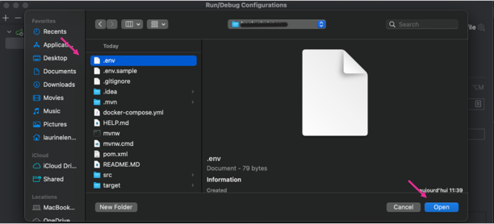

# Your backend API

## Set up 
1. Copie-colle le .env.sample en .env
2. Fait un `docker-compose up`
3. Rajoute le pluggin : https://plugins.jetbrains.com/plugin/7861-envfile
4. 
5. 
6. 

### Database
1. Crée une nouvelle base de donnée Postgre avec le nom de la base de donnée qui est dans le .env et les différent paramètres
2. Test connection & Apply
3. Tu run ensuite TABLES puis DEFAULT_ENTRIES. 
4. 

#

###### - Run DROP uniquement si tu veux refaire les tables 
###### - Pour refaire un compose up, supprime le precedent contenaire crée, ou crée en un avec un nom différent